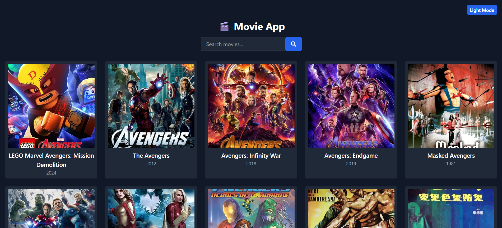
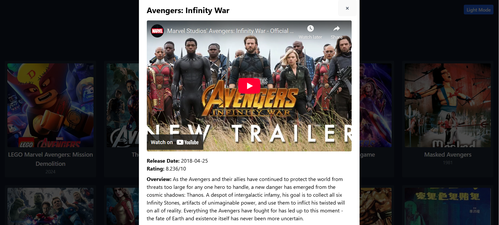

# 🎬 Movie App (React + Tailwind CSS + TMDB API)

A modern and responsive movie search application built using **React**, **Tailwind CSS**, and the **TMDB API**.  
It allows users to search for movies, view details, and **play official YouTube trailers** directly from the app.

---

## 🌟 Features
- 🔍 **Search Movies** — Search by title using the TMDB API  
- 🎥 **Watch Trailers** — Integrated YouTube trailers for movies  
- 📱 **Responsive Design** — Fully responsive UI using Tailwind CSS  
- 🌑 **Dark Mode Support** (if enabled in Tailwind)  
- ⚡ **Fast & Lightweight** — Built with Vite for blazing-fast performance  

---

## 📸 Screenshots

### 🎬 Home Page


### 📽 Trailer Playback


---

## 🚀 Live Demo
🔗 **[View Live App](https://durgarao3.github.io/Movie-app/)**

---

##  Folder Structure

/movie-app
│
├── src/
│ ├── App.jsx # Main movie search UI and logic
│ ├── main.jsx # React entry point
│ └── index.css # Tailwind base styles
│
├── public/ # Static assets (if present)
├── tailwind.config.js # Tailwind setup
├── postcss.config.js # PostCSS setup
└── package.json

---

##  Setup & Run Locally

```bash
# Clone the repository
git clone https://github.com/Durgarao3/Movie-app.git
cd Movie-app

# Install dependencies
npm install

# Start the development server
npm run dev
```

## Tools & Tech

1. React — Component-based UI
2. Tailwind CSS — Utility-first styling
3. Vite (or your bundler) — Fast build tool
4. TMDB API — Movie search & data

## Environment Notes

Make sure you add your TMDB API key securely when deploying or in environment variables

Author
Built and styled by Durgarao3

---

##  How to Add & Push to GitHub

In your project’s root directory (`Movie-app`):

```bash
# Step 1: Create the README.md
touch README.md
# Then paste the README content above into README.md

# Step 2: Stage and commit the file
git add README.md
git commit -m "Add README with project overview"

# Step 3: Push to GitHub
git push origin main
